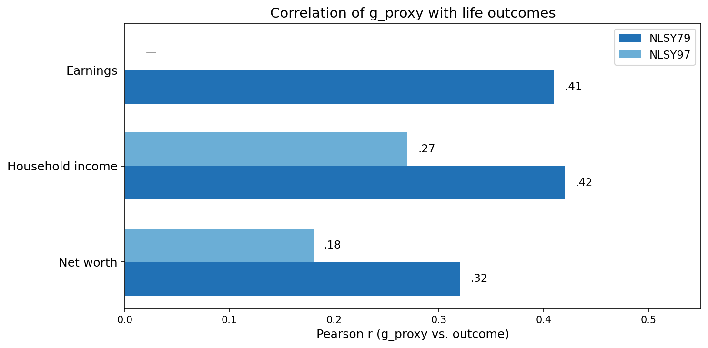
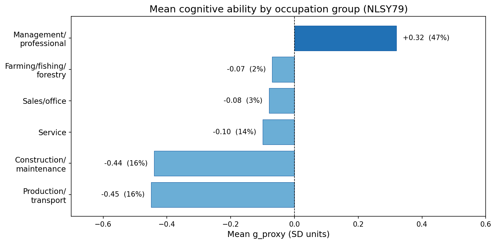
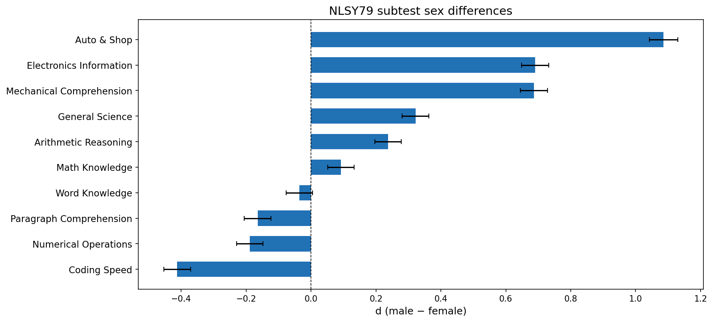
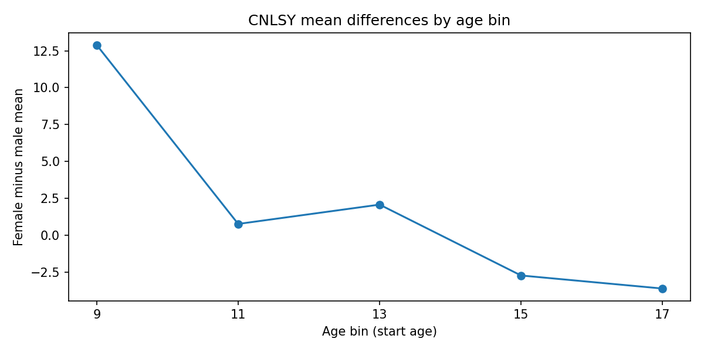
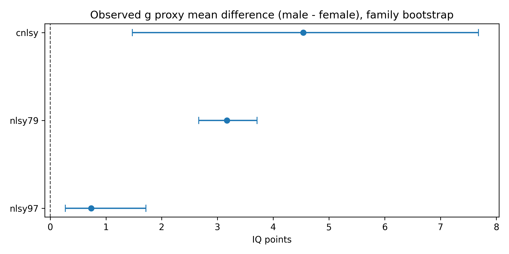
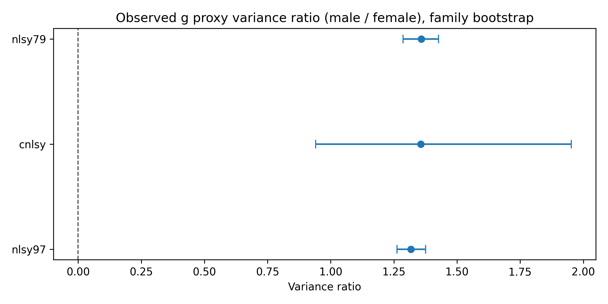
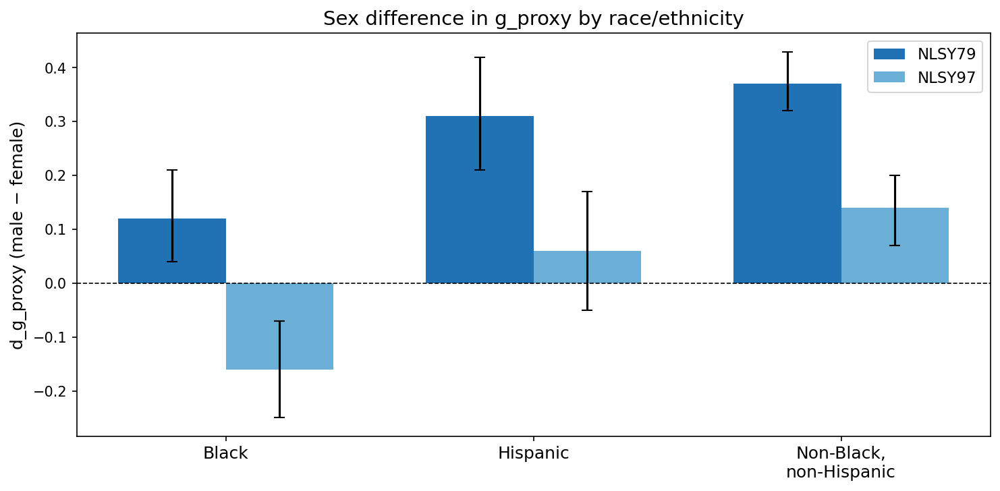
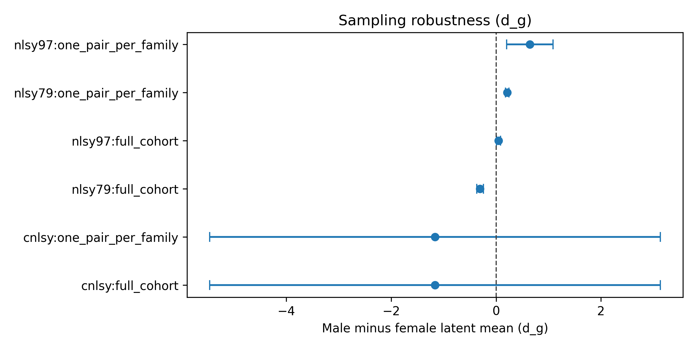

# cogdiff

Reproducible pipeline for extracting latent general cognitive ability (*g*) from ASVAB and PIAT test batteries, validating it against education, income, employment, and wealth outcomes, and examining how cognitive test performance and its predictive power vary across demographic and socioeconomic subgroups. Uses three cohorts of the National Longitudinal Survey of Youth spanning birth years 1957–present.

This repository ships **code, publication-locked result tables, and figures**. It does **not** ship NLSY microdata. Lawful access to the public-use files is required to reproduce the pipeline from scratch.

### Summary of findings

- Each SD of *g\_proxy* is associated with 2–5× higher odds of a bachelor's degree and 1.6–2.1× higher odds of employment across cohorts
- The observed mean sex difference (*d\_g\_proxy*) ranges from 0.06 in NLSY97 to 0.26 in NLSY79; the latent estimate in NLSY79 (the only cohort passing scalar invariance) is *d\_g* = 0.31 [0.24, 0.37]
- Males are consistently more variable (VR = 1.32–1.36 observed), stable across all three cohorts
- The earnings return per SD of cognitive ability roughly tripled between the 1960s and 1980s birth cohorts ($7.4k → $22–27k)
- Among Black respondents in NLSY97, the sex difference reverses (females outscore males by 0.16 SD); in NLSY79 the gap was small and male-favouring (0.12 SD)
- Black respondents accumulate 35–40% less net worth than their cognitive scores predict, in both cohorts; they obtain 4–5% more education than predicted
- 93% of the *g*–earnings association operates through channels other than education, employment status, or job complexity
- Maternal *g\_proxy* predicts child *g\_proxy* at β = 0.45 (*R*² = .23), largely independent of parental education
- Each SD of *g\_proxy* is associated with 35% lower odds of arrest (OR = 0.65) and 52% lower odds of incarceration (OR = 0.48) in NLSY97 adult event-history data; associations with adolescent self-report delinquency are mixed and outcome-dependent
- Higher *g* predicts lower odds of poor self-rated health (OR = 0.44–0.64), obesity (OR = 0.73–0.74), and depression (OR = 0.76–0.88) across cohorts
- Higher *g* predicts later first marriage (+0.6–0.7 yr/SD), later first birth (+2.8 yr/SD), fewer children, and 2.3–2.5× higher odds of homeownership

Sections 1–7 establish the measure's predictive validity. Section 8 presents the primary sex-difference estimates. Section 9 examines moderation by race/ethnicity and SES. Sections 11–15 report exploratory outcome associations (crime, health, mental health, family formation, welfare/housing).

---

## Data: the National Longitudinal Surveys

The [National Longitudinal Surveys](https://www.bls.gov/nls/) (NLS) are a set of panel surveys funded by the U.S. Bureau of Labor Statistics and administered by NORC at the University of Chicago, with data management by the Center for Human Resource Research at Ohio State. The NLS is the largest publicly available, free longitudinal dataset that pairs a comprehensive cognitive battery with decades of life-outcome data — no other U.S. survey combines a full multi-domain aptitude test with this breadth of labour-market, education, family, health, and wealth variables over this time span.

| Cohort | Birth years | *N* | Cognitive battery | Waves | Years |
|--------|-----------|-----|-------------------|-------|-------|
| **NLSY79** | 1957–1964 | 12,686 (11,914 tested, 94%) | ASVAB — 10 subtests (verbal, math, spatial, technical, speed) | 30 rounds | 1979–2022 |
| **NLSY97** | 1980–1984 | 8,984 (7,127 tested, 79%) | CAT-ASVAB — 12 subtests (computer-adaptive) | 20 rounds | 1997–2022 |
| **CNLSY** | Children of NLSY79 mothers | 11,545 children identified | PIAT — 3 subtests (math, reading recognition, reading comprehension) | 16 rounds | 1986–2014 |

<details>
<summary><strong>Why NLSY over other datasets</strong></summary>

| Dataset | Cognitive measure | Key differences |
|---------|-------------------|-----------------|
| **Add Health** (~20k) | Peabody Picture Vocabulary Test (single test) | One vocabulary test, not a multi-domain battery; restricted-use contract required for full sample |
| **HRS** (~20k/wave) | Brief memory/orientation screeners; HCAP subsample (*n* = 3,496) | Ages 50+; screeners, not aptitude tests |
| **PSID** (~25k) | Woodcock-Johnson (children only via CDS supplement) | No adult cognitive battery |
| **WLS** (~10k) | High school IQ from administrative records | One state (Wisconsin), one graduating class (1957) |

</details>

All NLS data are free and accessible through the [NLS Investigator](https://www.nlsinfo.org/investigator/) with no contract required. See [METHODS.md](public_facing_docs/METHODS.md) for variable mapping and data access details.

NLSY79 subtest completion is near-total (~94% tested). CNLSY has higher missingness: PIAT subtests ~20–30%, PPVT ~50%, Digit Span ~70–80%.

---

## Key terms

| Term | Meaning |
|------|---------|
| ***g*** | Latent general cognitive ability, extracted via structural equation modelling (SEM) from subtest batteries |
| **g\_proxy** | Observed unit-weighted composite of age-residualised, z-scored subtests — used for all exploratory analyses and when latent estimation is not feasible |
| **1 SD** | One standard deviation of *g* or *g\_proxy* ≈ **15 IQ points** on the conventional IQ scale (mean = 100, SD = 15) |
| **d** | Standardised mean difference (male − female). Positive *d* = males score higher. *d* = 0.20 ≈ 3 IQ points; *d* = 1.00 ≈ 15 IQ points |
| **VR** | Variance ratio (male variance / female variance). VR > 1 = males more variable |
| **OR** | Odds ratio per 1 SD increase in *g\_proxy* — e.g. OR = 2.0 means each SD doubles the odds |

See [METHODS.md](public_facing_docs/METHODS.md) for full definitions.

---

## Results

All results are from `outputs/tables/publication_results_lock/`. Effect sizes are bootstrap-estimated (499 SEM-refit replications) unless noted. See [METHODS.md](public_facing_docs/METHODS.md) for technical detail.

### 1. Cognitive ability predicts income, wealth, and education



#### Income and wealth

| Outcome | NLSY79 | NLSY97 |
|---------|--------|--------|
| Earnings | *r* = .41, β = +$4,928/SD (*n* = 5,475) | — |
| Household income | *r* = .42, β = +$23,146/SD (*n* = 4,736) | *r* = .27, β = +$21,125/SD (*n* = 5,168) |
| Net worth | *r* = .32, β = +$107,337/SD (*n* = 4,849) | *r* = .18, β = +$28,069/SD (*n* = 4,484) |

Cognitive ability is a stronger predictor of all economic outcomes in the older cohort. In NLSY79, *g\_proxy* explains 25% of earnings variance, 22% of income variance, and 12% of wealth variance. In NLSY97, the explained variance drops to 8% (income) and 4% (wealth). This decline may partly reflect age differences at measurement — NLSY79 respondents were 36–44 years old (peak career), while NLSY97 respondents were younger and still accumulating.

#### Education and employment

| Outcome | NLSY79 | NLSY97 |
|---------|--------|--------|
| Odds of employment | 1.9× per SD (*n* = 5,781, ages 36–44) | 2.1× per SD (*n* = 5,889, ages 27–32) |
| Odds of a bachelor's degree | 5.3× per SD (24% base rate) | 4.4× per SD (40% base rate) |
| Odds of a graduate degree | 4.8× per SD (8% base rate) | 3.3× per SD (18% base rate) |

The degree odds ratios are large: in NLSY79, each SD of *g\_proxy* multiplies the odds of holding a bachelor's degree by 5.3× and a graduate degree by 4.8×. The ORs are somewhat smaller in NLSY97, consistent with degree attainment becoming more common (base rate rose from 24% to 40% for bachelor's degrees).

#### Convergent validity

*g\_proxy* correlates strongly with college admissions tests in NLSY97: *r* = .53 (SAT Math, *n* = 2,013), *r* = .54 (SAT Verbal, *n* = 1,979), *r* = .64 (ACT, *n* = 1,701). These correlations confirm that the ASVAB-derived composite captures a construct closely related to academic aptitude.

#### Sex differences in predictive validity

*g\_proxy* predicts wages more strongly for males than females (β = $7,241 vs. $6,072, *p* = .002 in NLSY79) but predicts education more strongly for females in both cohorts (NLSY79: 1.78 vs. 1.66 years per SD, *p* = .024; NLSY97: 2.30 vs. 1.80 years per SD, *p* = .0003). The pattern is consistent across cohorts: cognitive ability has a larger wage payoff for men and a larger education payoff for women.

*Sources: `g_income_wealth_associations.csv`, `g_employment_outcomes.csv`, `degree_threshold_outcomes.csv`, `g_sat_act_validity.csv`, `asvab_life_outcomes_by_sex.csv`.*

---

### 2. Labour-market dynamics

Section 1 shows that cognitive ability predicts how *much* people earn at a point in time. This section asks a different question: does it also predict *stability* — who keeps earning, who stays employed, and whose income fluctuates?

All analyses use NLSY97 respondents (ages ~35–41) across two-wave panels (2019–2021) and a ten-year window (2011–2021).

#### Income trajectories: level vs. growth

| Model | β per SD | *p* | *R*² |
|-------|---------|-----|------|
| Annualized earnings growth rate | +0.009 | .56 | .003 |
| Follow-up earnings (controlling for baseline) | +$0.24 SD | < 10⁻²⁴ | .27 |
| Annualized household income growth rate | +0.027 | .34 | .001 |
| Follow-up household income (controlling for baseline) | +$0.58 SD | < 10⁻³⁸ | .30 |

*g\_proxy* does not predict the *rate* of income growth — higher-scoring individuals are not getting richer *faster*. But it strongly predicts follow-up income conditional on baseline, meaning it captures earning power that persists beyond what current income already explains.

#### Income instability

| Outcome | OR per SD | *p* | Interpretation |
|---------|----------|-----|---------------|
| Household income instability (top quartile) | 0.73 | < 10⁻⁹ | 27% lower odds of large income swings per SD |
| Earnings instability (top quartile) | 1.04 | .53 | No significant relationship |

Higher *g\_proxy* is associated with lower household-income volatility but not earnings volatility.

#### Employment persistence

| Model | OR per SD | *p* | *n* |
|-------|----------|-----|-----|
| Continuously employed 2019–2021 | 1.62 | < 10⁻²⁷ | 4,757 |
| Retained in 2021 given employed in 2019 | 1.57 | < 10⁻⁹ | 3,847 |
| Re-entered employment by 2021 given not employed in 2019 | 1.26 | .011 | 910 |
| Any employment transition 2011–2021 | 0.69 | < 10⁻²¹ | 4,757 |
| Two or more transitions 2011–2021 | 0.76 | .0002 | 4,757 |

Higher cognitive ability is associated with greater job stability at every margin — higher retention, higher re-entry, and fewer transitions over a decade. Each SD reduces the odds of any employment status change by 31%.

*Sources: `nlsy97_income_earnings_trajectories.csv`, `nlsy97_income_earnings_volatility.csv`, `nlsy97_employment_persistence.csv`, `nlsy97_employment_instability.csv`.*

---

### 3. Occupation and job quality

Using NLSY79 (ages 36–44, best occupation coverage among the three cohorts). Occupation is coded using Census 2002 major groups and linked to O\*NET Job Zones for complexity ratings.

#### Occupation sorting



| Occupation group | *n* | Share | Mean *g\_proxy* | Mean education | Mean HH income | Mean net worth |
|-----------------|-----|-------|----------------|---------------|---------------|---------------|
| Management/professional | 2,445 | 47% | +0.32 | 14.7 yrs | $74,749 | $225,065 |
| Service | 743 | 14% | -0.10 | 13.0 yrs | $48,326 | $97,868 |
| Construction/extraction/maintenance | 826 | 16% | -0.44 | 12.0 yrs | $36,563 | $50,957 |
| Production/transport | 848 | 16% | -0.45 | 12.5 yrs | $35,918 | $71,931 |
| Sales/office | 168 | 3% | -0.08 | 11.9 yrs | $49,087 | $94,228 |
| Farming/fishing/forestry | 124 | 2% | -0.07 | 12.4 yrs | $44,774 | $72,882 |

The *g\_proxy* gap between management/professional workers (+0.32 SD) and production/transport workers (-0.45 SD) is 0.77 SD — roughly 12 IQ points. This sorting is not just about education: management/professional workers average 14.7 years of education and $225k in net worth, versus 12.0–12.5 years and $51–72k for manual occupations. Each SD of *g\_proxy* triples the odds of entering a management/professional job (OR = 2.98, *p* < 10⁻¹⁵⁰).

#### Job complexity and mismatch

O\*NET Job Zones rate occupations on a 1–5 scale from "little preparation" to "extensive preparation." Each SD of *g\_proxy* is associated with +0.34 Job Zones (*R*² = .07, *n* = 3,113).

| Mismatch type | Prevalence | OR per SD | Mean *g\_proxy* of mismatched | Interpretation |
|---------------|-----------|----------|------------------------------|----------------|
| Overeducated for job | 14% | 2.75 | +0.47 | High-ability workers in jobs below their education level |
| Undereducated for job | 25% | 0.65 | -0.22 | Lower-ability workers in jobs above their education level |
| Overpaid for complexity | 7% | 3.80 | +0.69 | High-ability workers earning more than job complexity predicts |
| Underpaid for complexity | 12% | 0.55 | -0.28 | Lower-ability workers earning less than job complexity predicts |

Higher *g\_proxy* individuals are more likely to be overeducated and overpaid relative to their job's formal requirements.

#### NLSY97 comparison

Management/professional OR = 2.09 per SD in NLSY97, but occupation coverage is limited (779 of 6,992 respondents with valid codes). Among the 73 respondents with 2+ occupation waves, 54% changed major occupation group — but *g\_proxy* does not predict who changes (OR = 1.22, *p* = .57).

*Sources: `nlsy79_high_skill_occupation_outcome.csv`, `nlsy79_occupation_major_group_summary.csv`, `nlsy79_job_zone_complexity_outcome.csv`, `nlsy79_education_job_mismatch_*.csv`, `nlsy79_job_pay_mismatch_*.csv`, `nlsy97_high_skill_occupation_outcome.csv`, `nlsy97_occupational_mobility_*.csv`.*

---

### 4. Family and intergenerational transmission

#### Sibling fixed effects

Sibling fixed-effects models compare siblings raised in the same household, controlling for everything shared within a family — parental income, neighbourhood, school quality, parenting style. What remains is the within-family effect of cognitive ability: does the sibling with higher *g\_proxy* achieve better outcomes than their brother or sister?

| Outcome | Cohort | β within-family | β between-family | *p* | *R*² | Families | Individuals |
|---------|--------|----------------|-----------------|-----|------|----------|-------------|
| Education (years) | NLSY79 | +2.10 | +1.63 | < 10⁻⁸ | .46 | 25 | 54 |
| Education (years) | NLSY97 | +1.42 | +1.83 | < 10⁻²⁰ | .03 | 1,261 | 2,673 |
| Earnings ($/year) | NLSY79 | +$8,734 | +$8,524 | < 10⁻⁶ | .49 | 18 | 38 |
| Household income ($) | NLSY97 | +$6,427 | +$16,830 | .005 | .02 | 793 | 1,665 |
| Net worth ($) | NLSY97 | -$8,523 | +$22,599 | .08 | .01 | 825 | 1,736 |

**Reading the table:** The β within-family column is the causal-direction estimate — how much more the higher-scoring sibling earns or learns compared to the lower-scoring sibling, per SD of *g\_proxy*. The β between-family column is the ordinary population-level association, which may be inflated by family-level confounding.

For education in NLSY79, the within-family estimate (*+2.10 years*) exceeds the between-family estimate (*+1.63 years*). In NLSY97, the within-family estimate (*+1.42*) is smaller than between-family (*+1.83*). The cross-cohort difference is significant: the within-family education return to *g\_proxy* is 0.69 years smaller in NLSY97 than NLSY79 (*p* = .046).

NLSY79 household income (*p* = .85) and net worth (*p* = .61) estimates are not significant, but those cells have only 7 and 12 families, respectively — too few for reliable inference. NLSY97 net worth is marginally significant (*p* = .08) and negative, meaning higher-*g\_proxy* siblings do not accumulate more wealth within families.

#### Intergenerational transmission

Maternal *g\_proxy* (measured by ASVAB in NLSY79) predicts child *g\_proxy* (measured by PIAT in CNLSY) with β = 0.45, *R*² = .23 (*p* < 10⁻⁸, 115 mother-child pairs). Each SD increase in the mother's cognitive composite is associated with nearly half an SD increase in her child's composite. Adding parental education to the model attenuates the coefficient by only 10% (β = 0.40, ΔR² < .002), indicating that the mother-child cognitive link operates largely independently of formal schooling.

*Sources: `sibling_fe_g_outcome.csv`, `sibling_fe_cross_cohort_contrasts.csv`, `sibling_discordance.csv`, `intergenerational_g_transmission.csv`, `intergenerational_g_attenuation.csv`.*

---

### 5. Childhood cognitive ability and adult outcomes (CNLSY)

CNLSY children were tested with the PIAT battery at ages 5–14 and then followed into adulthood. This is a prospective design: childhood cognitive ability measured a decade or more before the outcome. Adult outcomes come from the 2014 survey wave, when most respondents were in their mid-20s — early in their careers.

| Outcome | β per SD | *p* | *R*² | *n* |
|---------|---------|-----|------|-----|
| Family income | +$45,421 | .0001 | .21 | 69 |
| Education years | +0.07 | .09 | .09 | 171 |
| Wage income | +$107 | .58 | .002 | 154 |

Family income is the strongest predictor: each SD of childhood *g\_proxy* is associated with $45k higher family income in young adulthood, explaining 21% of the variance. The education and wage effects are weaker and not statistically significant at *p* < .05. Respondents were ~25 at measurement, early in their careers.

**Robustness to mother's SES:** Controlling for the mother's socioeconomic status attenuates the family-income coefficient by only 2% (log-scale β: 0.83 → 0.82).

Sample sizes are small (69–171) because only CNLSY respondents with both childhood PIAT scores and 2014 adult outcomes are included. Results should be interpreted with appropriate caution.

*Sources: `cnlsy_adult_outcome_associations.csv`, `cnlsy_carryover_net_mother_ses_summary.csv`.*

---

### 6. Subtest profiles, nonlinearity, and mediation

#### Which cognitive abilities matter most?



The ASVAB measures 10 distinct cognitive domains. Rather than treating them as a single score, we can ask: which specific abilities best predict each outcome?

| Cohort | Outcome | Best single predictor | *R*² | Interpretation |
|--------|---------|----------------------|------|----------------|
| NLSY79 | Earnings | Technical factor (GS, AS, MC, EI) | .16 | Mechanical/applied knowledge predicts pay |
| NLSY79 | Education | Math Knowledge subtest | .33 | Math skill is the strongest single predictor of years of schooling |
| NLSY79 | Household income | Math factor (AR, MK) | .18 | Quantitative reasoning predicts household-level income |
| NLSY97 | ACT | Verbal factor (WK, PC) | .40 | Verbal skills drive college admissions test performance |
| NLSY97 | SAT Verbal | Word Knowledge subtest | .35 | Vocabulary specifically tracks the SAT verbal section |
| NLSY97 | SAT Math | Math factor (AR, MK) | .30 | Quantitative reasoning maps onto SAT math |
| CNLSY | Education | PIAT Reading Recognition | .13 | Early reading ability predicts later schooling |

#### Profile tilt: do sex differences in subtest patterns matter?

Males score relatively higher on quantitative and technical subtests, females on verbal subtests. This "profile tilt" is *d* = 0.43 in NLSY79 and *d* = 0.12 in NLSY97 (a substantial narrowing across cohorts). But tilt is nearly uncorrelated with overall cognitive ability (*r* ≈ -.01) and adds almost nothing to predicting education beyond *g* alone (ΔR² < .003). In other words, the male-female difference in *which* subtests are strongest does not meaningfully affect life outcomes once overall level is accounted for.

#### Nonlinearity: are returns to cognitive ability accelerating or flat?

| Outcome | Cohort | Quadratic *g*² | *p* | ΔR² | Interpretation |
|---------|--------|---------------|-----|------|----------------|
| Log earnings | NLSY79 | -0.20 | < 10⁻⁶ | .004 | Slight diminishing returns |
| Log household income | NLSY79 | -0.13 | < 10⁻⁸ | .006 | Slight diminishing returns |
| Log household income | NLSY97 | -0.28 | < 10⁻²⁰ | .015 | Moderate diminishing returns |
| Employment | Both | -0.07 | .02 | .001 | Essentially flat |

Quadratic terms are statistically significant for some income outcomes but practically small — the relationship between *g\_proxy* and income is approximately linear. Threshold models show that the returns to degree attainment are concentrated above the median: the top 20% of the *g\_proxy* distribution captures the large degree effects.

#### Mediation: how does cognitive ability get converted into earnings?

Mediation analysis asks what *channels* connect *g\_proxy* to earnings. Using NLSY79 log-earnings:

| Mediator | % of *g*-earnings link explained | ΔR² |
|----------|--------------------------------|------|
| Education (years) | 6% | .001 |
| Employment status | 17% | .056 |
| Job complexity (O\*NET Zone) | -3% (suppressor) | .001 |
| All mediators combined | 7% | .015 |

For household income, mediation is stronger: education accounts for 19%, employment for 15%, and all mediators together for 29%.

Education alone explains 6% of the *g*-earnings association. Being employed is a larger channel (17%). And most of the association (93%) operates through pathways not captured by education, employment, or job complexity — likely including on-the-job performance, negotiation, and career decisions.

*Sources: `subtest_predictive_validity.csv`, `subtest_profile_tilt.csv`, `nonlinear_threshold_outcome_summary.csv`, `nlsy79_mediation_summary.csv`.*

---

### 7. Cohort change: is cognitive ability more or less valuable over time?

NLSY79 respondents were born 1957–1964; NLSY97 respondents were born 1980–1984. By comparing the two cohorts at the same ages (36–42) — one measured in the early 2000s, the other in the early 2020s — we can estimate how the **economic return to 1 SD of *g\_proxy*** has changed across a generation.

| Outcome | NLSY79 β per SD | NLSY97 β per SD | Change | *p* |
|---------|----------------|----------------|--------|-----|
| Annual earnings | $7,400–7,600 | $22,300–26,500 | +$15,000–19,000 | < 10⁻⁴⁰ |
| Education | 1.65 years | 1.99 years | +0.34 years | < 10⁻⁵ |
| Net worth | $125,747 | $27,260 | -$98,487 | < 10⁻⁶³ |
| Employment (log-odds) | 0.66 | 0.66 | -0.02 | .76 |

Each SD of cognitive ability is worth roughly **3× more in earnings** in the 1980s birth cohort than the 1960s cohort ($22k vs. $7k per SD). The education premium also grew. Net worth moved in the opposite direction — the wealth return to cognitive ability dropped sharply. Employment shows no change: the odds of being employed per SD of *g\_proxy* are identical in both cohorts (*p* = .76).

#### Developmental trajectories (CNLSY)



CNLSY children were tested repeatedly at ages 5–15, allowing us to track how sex differences develop across childhood. Both mean differences and variance ratios follow nonlinear trajectories with turning points around ages 13–14 — the onset of puberty. Male means rise relative to female means through early adolescence, while variance ratios peak and then stabilise.

#### Stability of variance ratios across cohorts

Despite spanning birth years from the 1950s to the 2000s, the male-to-female variance ratio in cognitive scores is remarkably stable across all three cohorts: VR ranges from 1.12 to 1.31 (latent) and 1.32 to 1.36 (observed), with a coefficient of variation of just .08. Males are consistently more variable, and this pattern does not appear to be changing over time.

*Sources: `age_matched_cross_cohort_contrasts.csv`, `cross_cohort_predictive_validity_contrasts.csv`, `cnlsy_nonlinear_age_patterns.csv`, `cross_cohort_pattern_stability.csv`.*

---

### 8. Sex differences in means and variance

This section reports the core psychometric findings: how large is the male-female gap in cognitive ability, and how variable are the two distributions?



#### Latent *d\_g* (invariance-gated)

Comparing latent means between groups requires **scalar measurement invariance** — evidence that the test items measure the same construct with the same scaling in both groups. Without scalar invariance, observed group differences could reflect measurement bias rather than true ability differences. NLSY79 is the only cohort that passes this gate:

| Cohort | Latent *d\_g* | SE | 95% CI | IQ-scale equivalent |
|--------|-------------|-----|--------|---------------------|
| NLSY79 | 0.31 | 0.03 | [0.24, 0.37] | ~4.6 IQ points |

NLSY97 and CNLSY failed scalar invariance (ΔCFI and/or ΔRMSEA exceeded thresholds), so their latent mean differences are excluded from confirmatory reporting. This does not mean sex differences are absent in those cohorts — only that the latent model cannot cleanly separate true differences from measurement artefacts. See `confirmatory_exclusions.csv`.

#### Observed *d\_g\_proxy* (all cohorts)

The observed composite (*g\_proxy*) does not require invariance assumptions and is reported for all cohorts:

| Cohort | *d\_g\_proxy*† | SE | 95% CI† | IQ-scale equivalent | *n* |
|--------|-------------|-----|--------|---------------------|-----|
| NLSY79 | 0.26 | 0.02 | [0.18, 0.25] | ~3.9 IQ points | 9,261 |
| NLSY97 | 0.06 | 0.03 | [0.02, 0.11] | ~0.9 IQ points | 6,992 |
| CNLSY | 0.41 | 0.12 | [0.08, 0.54] | ~6.1 IQ points | 545 |

†Point estimates are from the baseline single fit; CIs are percentile bootstrap intervals (499 family-level resamples with SEM refit). Because these come from different estimation procedures, a point estimate can fall outside its CI — this is a known property of percentile bootstrap intervals, not an error.

The male advantage in mean cognitive scores is small to moderate in NLSY79 (~4 IQ points), near zero in NLSY97 (~1 IQ point), and larger but imprecisely estimated in CNLSY (wide CI reflects *n* = 545). The cross-cohort decline from *d* = 0.26 to 0.06 suggests that the mean sex difference narrowed substantially between the 1960s and 1980s birth cohorts.

#### Variance ratios



While means may differ modestly, the **spread** of male scores is consistently wider than female scores in all cohorts:

| Cohort | VR\_g (latent) | VR\_g\_proxy (observed) | 95% CI (observed) |
|--------|---------------|----------------------|-------------------|
| NLSY79 | 1.31 | 1.36 | [1.29, 1.43] |
| NLSY97 | 1.25 | 1.32 | [1.26, 1.38] |
| CNLSY | 1.12 | 1.36 | [0.89, 1.96] |

A VR of 1.36 means the male score distribution is 36% wider than the female distribution. In practical terms, this means males are overrepresented at both the highest and lowest score levels. Unlike the mean difference (which narrowed across cohorts), variance ratios are stable across all three cohorts.

*Sources: `g_mean_diff.csv`, `g_proxy_mean_diff_family_bootstrap.csv`, `g_variance_ratio.csv`, `g_proxy_variance_ratio_family_bootstrap.csv`.*

---

### 9. Race/ethnicity and SES moderation

The results in sections 1–8 treat each cohort as a single population. This section asks whether the findings — sex differences, variance ratios, predictive validity — hold across racial/ethnic groups and socioeconomic strata, or whether they are artefacts of population composition.

#### Race/ethnicity measurement invariance

Before comparing groups, we test whether the ASVAB/PIAT measures the same construct the same way across racial/ethnic groups. Metric invariance (equal factor loadings) ensures the test ranks people similarly; scalar invariance (equal intercepts) ensures scores are on the same scale.

| Cohort | Metric invariance | Scalar invariance | Implication |
|--------|-------------------|-------------------|-------------|
| NLSY79 | Failed (ΔCFI) | Passed | Factor loadings differ — race-group mean comparisons on latent *g* are not valid |
| NLSY97 | Passed | Passed | Full comparability — latent means and variance ratios can be compared across groups |
| CNLSY | Passed | Failed (ΔRMSEA) | Loadings equivalent, intercepts differ — latent mean comparisons not valid |

#### Sex differences by race/ethnicity



The male-female *g\_proxy* gap is not uniform across racial/ethnic groups. Cochran's Q test rejects homogeneity in both NLSY79 (*Q* = 25.5, *p* < 10⁻⁵) and NLSY97 (*Q* = 26.4, *p* < 10⁻⁵):

| Cohort | Group | *n* | *d\_g\_proxy* | 95% CI | Direction |
|--------|-------|-----|-------------|--------|-----------|
| NLSY79 | Black | 2,345 | 0.12 | [0.04, 0.21] | Males slightly higher |
| NLSY79 | Hispanic | 1,361 | 0.31 | [0.21, 0.42] | Males higher |
| NLSY79 | Non-Black, non-Hispanic | 5,555 | 0.37 | [0.32, 0.43] | Males higher |
| NLSY97 | Black | 1,784 | **-0.16** | [-0.25, -0.07] | **Females higher** |
| NLSY97 | Hispanic | 1,346 | 0.06 | [-0.05, 0.17] | No significant difference |
| NLSY97 | Non-Black, non-Hispanic | 3,862 | 0.14 | [0.07, 0.20] | Males slightly higher |
| CNLSY | Black | 43 | 0.47 | [-0.14, 1.08] | Wide CI — underpowered |
| CNLSY | Hispanic | 31 | 0.23 | [-0.51, 0.97] | Wide CI — underpowered |
| CNLSY | Non-Black, non-Hispanic | 109 | 0.37 | [-0.01, 0.75] | Borderline |

Among Black respondents in NLSY97, the sex gap **reverses** — females outscore males by 0.16 SD (*p* < .001). In NLSY79, the gap among Black respondents was small but male-favouring (*d* = 0.12). This reversal, combined with the narrowing across all groups from NLSY79 to NLSY97, means that the overall male advantage reported in section 8 is driven primarily by non-Black respondents. CNLSY estimates are too imprecise to interpret (cell sizes of 31–109).

#### Variance ratios by race/ethnicity

Greater male variability is not limited to the overall population — it appears within each racial/ethnic group:

| Cohort | Group | VR\_g\_proxy | 95% CI |
|--------|-------|-------------|--------|
| NLSY79 | Black | 1.44 | [1.28, 1.61] |
| NLSY79 | Hispanic | 1.27 | [1.09, 1.48] |
| NLSY79 | Non-Black, non-Hispanic | 1.36 | [1.26, 1.47] |
| NLSY97 | Black | 1.13 | [0.99, 1.29] |
| NLSY97 | Hispanic | 1.18 | [1.01, 1.37] |
| NLSY97 | Non-Black, non-Hispanic | 1.38 | [1.26, 1.51] |

In NLSY79, the largest VR is among Black respondents (1.44), not the majority group. In NLSY97, VR among Black respondents drops to 1.13 (CI includes 1.0). CNLSY cell sizes are too small for reliable race-stratified VR estimates (*n* = 11–57 per group).

#### Sex differences by SES (parental education)

SES is defined by parental education terciles (low, mid, high). The male-female cognitive gap interacts with SES differently in each cohort:

| Cohort | Low SES | Mid SES | High SES | Pattern |
|--------|---------|---------|----------|---------|
| NLSY79 | 0.09 | 0.31 | 0.47 | Gap grows with SES |
| NLSY97 | 0.11 | 0.11 | 0.07 | Flat across SES |
| CNLSY | 0.54 | 0.50 | 0.04 | Gap shrinks with SES |

In NLSY79, males outscore females by nearly half an SD in high-SES families but show almost no difference in low-SES families. This gradient vanishes in NLSY97, where the sex difference is uniformly small regardless of background. CNLSY shows the opposite pattern — the largest gap is at low SES — though the small sample warrants caution.

#### Life-outcome odds ratios by race/ethnicity and sex

Sections 1 and 9 above show that *g\_proxy* predicts degree attainment and employment in the overall population. Here we ask: does it predict these outcomes *within* each race/ethnicity and sex group? This tests whether the overall associations are driven by between-group composition effects or reflect genuine within-group prediction.

**Employment odds ratio per SD of *g\_proxy*:**

| Group | NLSY79 OR | *n* | NLSY97 OR | *n* |
|-------|----------|-----|----------|-----|
| Black | 3.08× | 1,805 | 2.28× | 1,383 |
| Hispanic | 1.99× | 1,045 | 1.85× | 982 |
| Non-Black, non-Hispanic | 1.77× | 2,931 | 2.00× | 2,654 |
| Male | 2.65× | 2,746 | 1.89× | 2,423 |
| Female | 1.46× | 3,035 | 2.23× | 2,596 |

The employment return to cognitive ability is **largest for Black respondents** in both cohorts (3.1× and 2.3× per SD), substantially exceeding the majority-group OR. In NLSY79, the male employment OR (2.65×) far exceeds the female OR (1.46×); in NLSY97 this gap reverses, with females showing a stronger employment return (2.23× vs. 1.89×).

**Bachelor's degree odds ratio per SD of *g\_proxy*:**

| Group | NLSY79 OR | Base rate | NLSY97 OR | Base rate |
|-------|----------|-----------|----------|-----------|
| Black | 7.91× | 18% | 5.14× | 30% |
| Hispanic | 4.90× | 16% | 4.04× | 30% |
| Non-Black, non-Hispanic | 8.79× | 30% | 5.05× | 48% |
| Male | 6.47× | 22% | 4.60× | 34% |
| Female | 6.25× | 26% | 4.84× | 45% |

Cognitive ability predicts degree attainment strongly within every group. The ORs are large everywhere — the smallest (Hispanic in NLSY97, 4.04×) still means each SD quadruples the odds. ORs are somewhat smaller in NLSY97, consistent with the higher base rates (more people obtaining degrees reduces the marginal predictive power of any single factor).

<details>
<summary><strong>Race × sex breakdown for bachelor's degree OR</strong></summary>

| Group | NLSY79 OR | Base rate | NLSY97 OR | Base rate |
|-------|----------|-----------|----------|-----------|
| Black male | 7.85× | 15% | 4.65× | 20% |
| Black female | **11.16×** | 20% | **6.14×** | 39% |
| Hispanic male | 6.01× | 14% | 4.63× | 27% |
| Hispanic female | 6.43× | 18% | 3.88× | 33% |
| Non-Black, non-Hispanic male | **13.30×** | 29% | 4.99× | 43% |
| Non-Black, non-Hispanic female | 12.16× | 32% | 6.42× | 53% |

The largest ORs are among non-Black males in NLSY79 (13.3×) and Black females in both cohorts (11.2× and 6.1×). Black female BA attainment nearly doubled from 20% to 39% across cohorts, yet *g\_proxy* remains a powerful predictor within this group. The base-rate shift is dramatic across the board: non-Black female BA attainment rose from 32% to 53%.

</details>

<details>
<summary><strong>Graduate degree odds ratio per SD</strong></summary>

| Group | NLSY79 OR | Base rate | NLSY97 OR | Base rate |
|-------|----------|-----------|----------|-----------|
| Black | 4.61× | 5% | 4.62× | 14% |
| Hispanic | 5.15× | 6% | 4.21× | 12% |
| Non-Black, non-Hispanic | 7.13× | 11% | 3.40× | 21% |
| Male | 7.38× | 7% | 3.51× | 14% |
| Female | 5.04× | 9% | 3.68× | 21% |

Graduate-degree base rates roughly doubled or tripled across cohorts for all groups. The OR compression from NLSY79 to NLSY97 is most pronounced for the non-Black, non-Hispanic group (7.1× → 3.4×), consistent with higher base rates reducing marginal predictive power.

CNLSY respondents are too young (~25 in 2014) for degree or employment disaggregation — none had attained a BA in the available data.

</details>

*Sources: `outcomes_by_race_sex.csv`.*

<details>
<summary><strong>SAT/ACT validity by race/ethnicity and SES (NLSY97)</strong></summary>

*g\_proxy* predicts college admissions tests within every subgroup, confirming that it is not a population-specific artefact:

| Test | Black *r* | Hispanic *r* | Non-Black non-Hispanic *r* | Low SES *r* | Mid SES *r* | High SES *r* |
|------|-----------|-------------|---------------------------|------------|------------|-------------|
| SAT Math | .31 | .41 | .55 | .45 | .57 | .58 |
| SAT Verbal | .38 | .39 | .53 | .48 | .57 | .53 |
| ACT | .43 | .37 | .66 | .60 | .64 | .67 |

Correlations are positive and substantial in all cells. They are somewhat lower for minority groups.

</details>

#### Predictive power of *g\_proxy* by SES (NLSY79)

Does cognitive ability matter more for people from privileged or disadvantaged backgrounds? In NLSY79, the returns to *g\_proxy* are significantly larger for high-SES individuals across all outcomes:

| Outcome | Low-SES β per SD | High-SES β per SD | Ratio | Heterogeneity *p* |
|---------|-----------------|------------------|-------|-------------------|
| Earnings | $5,714 | $7,980 | 1.4× | .00009 |
| Education | 1.14 years | 1.63 years | 1.4× | 2 × 10⁻⁹ |
| Household income | $18,926 | $34,455 | 1.8× | 2 × 10⁻⁶ |
| Net worth | $65,187 | $169,243 | 2.6× | 2 × 10⁻⁸ |

The SES gradient is most dramatic for wealth: each SD of *g\_proxy* is associated with $169k of net worth among high-SES individuals but only $65k among low-SES individuals — a 2.6× multiplier.

In NLSY97, **none** of the SES × *g\_proxy* interactions are significant (all *p* > .12).

<details>
<summary><strong>Who reaches the top 10% and top 1%?</strong></summary>

The analyses above use regression models — averages and odds ratios. This subsection takes a simpler approach: for each outcome, who actually ends up in the top 10% (and top 1%) of the distribution? The "representation ratio" compares a group's share of the top tier to its share of the overall sample. A ratio of 1.0 = proportional representation; >1.0 = overrepresented; <1.0 = underrepresented.

**Top 10% of cognitive ability (*g\_proxy*) by sex:**

| Cohort | Males in top 10% | Male share of sample | Ratio | Females in top 10% | Female ratio |
|--------|-----------------|---------------------|-------|-------------------|-------------|
| NLSY79 | 75.4% (*n* = 699) | 49.5% | **1.52** | 24.6% (*n* = 228) | 0.49 |
| NLSY97 | 64.9% (*n* = 454) | 50.5% | **1.28** | 35.1% (*n* = 246) | 0.71 |

At the **top 1%**, the overrepresentation is even more extreme:

| Cohort | Males in top 1% | Male ratio | Females in top 1% | Female ratio |
|--------|----------------|-----------|-------------------|-------------|
| NLSY79 | 92.5% (*n* = 86) | **1.87** | 7.5% (*n* = 7) | 0.15 |
| NLSY97 | 78.6% (*n* = 55) | **1.55** | 21.4% (*n* = 15) | 0.43 |

In NLSY79, only 7 out of 93 people in the top 1% of cognitive scores are female. This is consistent with greater male variability (VR ≈ 1.36) — even with a small mean difference, a wider male distribution pushes substantially more males into the extreme tails. The effect is weaker in NLSY97, consistent with the narrower mean gap in that cohort.

**Top 10% of economic outcomes by sex:**

| Outcome | Cohort | Male share of top 10% | Male ratio | Female share of top 10% | Female ratio |
|---------|--------|----------------------|-----------|------------------------|-------------|
| Earnings | NLSY79 | 77.6% | **1.63** | 22.4% | 0.43 |
| Earnings | NLSY97 | 68.4% | **1.36** | 31.6% | 0.63 |
| Household income | NLSY79 | 50.2% | 1.06 | 49.8% | 0.95 |
| Household income | NLSY97 | 53.1% | 1.10 | 46.9% | 0.91 |
| Net worth | NLSY79 | 50.1% | 1.02 | 49.9% | 0.98 |
| Net worth | NLSY97 | 52.7% | 1.04 | 47.3% | 0.96 |
| Education | NLSY79 | 44.8% | 0.90 | **55.2%** | **1.09** |
| Education | NLSY97 | 39.5% | 0.78 | **60.5%** | **1.22** |

Males are 78% of top earners in NLSY79, exceeding their cognitive overrepresentation. For household income and net worth, the top 10% is split approximately 50/50 between sexes. For education, the pattern reverses: females are 61% of the top education tier in NLSY97.

**Top 10% of cognitive ability by race/ethnicity:**

| Cohort | Group | Share of top 10% | Share of sample | Ratio |
|--------|-------|-----------------|----------------|-------|
| NLSY79 | Black | 3.6% | 25.3% | 0.14 |
| NLSY79 | Hispanic | 5.6% | 14.7% | 0.38 |
| NLSY79 | Non-Black, non-Hispanic | 90.8% | 60.0% | 1.51 |
| NLSY97 | Black | 4.4% | 25.5% | 0.17 |
| NLSY97 | Hispanic | 5.9% | 19.3% | 0.30 |
| NLSY97 | Non-Black, non-Hispanic | 89.7% | 55.2% | 1.62 |

The racial disparity in top-tier cognitive scores is large and stable across cohorts: Black respondents are 25% of the sample but only 4% of the top cognitive decile.

**Top 10% of economic outcomes by race/ethnicity (NLSY79):**

| Outcome | Black share of top 10% (25% of sample) | Hispanic (15%) | Non-Black, non-Hispanic (60%) |
|---------|---------------------------------------|---------------|------------------------------|
| Earnings | 13.0% (ratio: 0.49) | 12.6% (0.79) | 74.4% (1.29) |
| Household income | 12.4% (0.43) | 12.9% (0.70) | 74.7% (1.42) |
| Net worth | 8.0% (0.26) | 11.8% (0.64) | 80.2% (1.58) |
| Education | 20.1% (0.80) | 10.3% (0.70) | 69.6% (1.16) |

The racial disparity is smaller for economic outcomes than for cognitive scores — Black respondents are 13% of top earners (ratio 0.49) but only 4% of the top cognitive decile (ratio 0.14). The gap is widest for net worth (ratio 0.26), narrowest for education (ratio 0.80).

**SAT/ACT (NLSY97, top 10%) by race/ethnicity:**

| Test | Black share of top 10% (21–23% of test-takers) | Non-Black, non-Hispanic share |
|------|-----------------------------------------------|------------------------------|
| SAT Math | 11.5% (ratio: 0.56) | 79.6% (1.24) |
| SAT Verbal | 10.2% (ratio: 0.50) | 80.3% (1.24) |
| ACT | 8.7% (ratio: 0.39) | 83.9% (1.23) |

</details>

#### Outcome gaps after controlling for cognitive ability

The analyses above show that *g\_proxy* predicts outcomes within every group. But a different question is: given two people with the **same** *g\_proxy* score, does one group systematically earn more, accumulate more wealth, or obtain more education than another?

To answer this, we fit a pooled regression (outcome ~ *g\_proxy* + age) on the full sample and compute the mean residual for each group. A positive residual means the group **overperforms** relative to what *g\_proxy* predicts; a negative residual means it **underperforms**.

**By race/ethnicity — mean residual (% of predicted):**

| Outcome | NLSY79 Black | NLSY79 Hispanic | NLSY79 Non-Black, NH | NLSY97 Black | NLSY97 Hispanic | NLSY97 Non-Black, NH |
|---------|-------------|----------------|---------------------|-------------|----------------|---------------------|
| Earnings | +5.0% | +8.2% | -4.0% | -2.4% | -0.5% | +0.9% |
| Household income | -4.6% | +4.4% | +0.4% | **-13.1%** | -0.9% | +4.4% |
| Net worth | **-34.8%** | -1.4% | +8.0% | **-40.0%** | -12.7% | +16.1% |
| Education | **+5.3%** | -0.9% | -2.6% | **+4.1%** | -0.1% | -1.8% |

The **net worth gap** is the largest: Black respondents accumulate 35–40% less wealth than their cognitive ability predicts, in both cohorts (*p* < 10⁻¹⁰). This gap persists — and slightly widens — from NLSY79 to NLSY97. Household income shows a similar but smaller pattern (13% underperformance in NLSY97).

Black respondents **overperform** on education by 4–5% in both cohorts — they obtain more schooling than *g\_proxy* alone predicts.

**By sex — mean residual (% of predicted):**

| Outcome | NLSY79 Male | NLSY79 Female | NLSY97 Male | NLSY97 Female |
|---------|-----------|-------------|-----------|-------------|
| Earnings | **+22.6%** | **-22.4%** | **+14.4%** | **-14.9%** |
| Household income | -2.9% | +2.9% | +2.7% | -2.6% |
| Net worth | -6.8% | +8.1% | +4.5% | -4.6% |
| Education | -2.9% | +2.7% | -3.5% | +3.4% |

The **earnings gap by sex** is large: in NLSY79, males earn 23% more than their *g\_proxy* predicts and females earn 22% less (*p* < 10⁻³⁸ and < 10⁻⁵⁷). This gap narrows from ±23% to ±15% between cohorts but remains highly significant. Household income, net worth, and education show near-zero sex residuals — the earnings gap does not carry over to household-level outcomes, and females slightly outperform on education.

<details>
<summary><strong>Race × sex breakdown (earnings and education residuals)</strong></summary>

| Group | NLSY79 earnings gap | NLSY97 earnings gap | NLSY79 education gap | NLSY97 education gap |
|-------|-------------------|-------------------|---------------------|---------------------|
| Black male | +21.4% | +5.9% | +2.3% | -1.3% |
| Black female | -10.6% | -8.5% | **+8.1%** | **+8.5%** |
| Hispanic male | +35.0% | +12.8% | -4.0% | -0.7% |
| Hispanic female | -19.3% | -14.4% | +1.9% | +0.5% |
| Non-Black, NH male | +19.9% | +17.0% | -5.3% | -5.2% |
| Non-Black, NH female | -27.7% | -17.5% | -0.0% | +1.8% |

Hispanic males show the largest earnings overperformance (+35% in NLSY79). Black females show the largest education overperformance (+8% in both cohorts). Non-Black, non-Hispanic males underperform on education by 5% in both cohorts despite overperforming on earnings by 17–20%.

</details>

*Sources: `race_invariance_eligibility.csv`, `race_sex_group_estimates.csv`, `race_sex_interaction_summary.csv`, `ses_moderation_group_estimates.csv`, `g_sat_act_validity_by_race.csv`, `g_sat_act_validity_by_ses.csv`, `g_outcome_associations_by_ses_summary.csv`, `outcomes_by_race_sex.csv`, `top_percentile_representation.csv`, `outcome_residuals_by_group.csv`.*

---

### 10. Robustness

The specification curve below varies analytic choices — age-adjustment method, sampling strategy, model form, weighting, and inference procedure — to test how stable the primary estimates are across different pipeline configurations.



Full robustness tables: `specification_stability_summary.csv`, `robustness_sampling.csv`, `robustness_age_adjustment.csv`, `robustness_model_forms.csv`, `robustness_weights.csv`, `robustness_inference.csv`.

---

### 11. Crime and justice outcomes

Each outcome is modelled as logistic(*outcome* ~ intercept + *g\_proxy* + age). Adult outcomes use NLSY97 event-history arrest/incarceration status through December 2019 (any value > 0 → ever). Adolescent outcomes use self-report items: NLSY97 (1997 baseline, ever yes/no, age 13–17) and NLSY79 (1980 past-year counts binarized to any > 0, age 16–23).

**NLSY97 — adult event-history outcomes**

| Outcome | *n* | Prevalence | OR per SD *g* | *p* |
|---------|-----|-----------|---------------|-----|
| Ever arrested | 5,458 | 34.4% | 0.65 | < 10⁻³⁰ |
| Ever incarcerated | 5,458 | 9.5% | 0.48 | < 10⁻³³ |

Each SD increase in *g\_proxy* is associated with 35% lower odds of ever being arrested and 52% lower odds of ever being incarcerated.

**NLSY97 — adolescent self-report (1997)**

| Outcome | *n* | Prevalence | OR per SD *g* | *p* |
|---------|-----|-----------|---------------|-----|
| Attacked someone | 6,975 | 17.9% | 0.67 | < 10⁻²³ |
| Sold drugs | 6,976 | 6.7% | 0.90 | 0.08 |
| Destroyed property | 6,977 | 27.5% | 1.04 | 0.29 |
| Theft (any) | 6,980 | 34.0% | 1.04 | 0.17 |

The violence association is large and significant; property and theft items show no reliable association with *g*.

**NLSY79 — adolescent self-report composites (1980)**

| Outcome | *n* | Prevalence | OR per SD *g* | *p* |
|---------|-----|-----------|---------------|-----|
| Any violent crime | 8,840 | 45.2% | 0.83 | < 10⁻¹¹ |
| Any property crime | 8,841 | 42.9% | 1.16 | < 10⁻⁷ |
| Any drug selling | 8,771 | 11.8% | 1.16 | < 10⁻³ |

In the NLSY79 self-report data, violent crime shows the expected negative association with *g*. Property crime and drug selling show small positive associations — a pattern consistent with self-report delinquency literature, where higher-ability adolescents may report more minor non-violent offenses.

Full table: `outputs/tables/g_crime_justice_outcomes.csv`.

### 12. Health and substance use outcomes

Each outcome is modelled as logistic(*outcome* ~ intercept + *g\_proxy* + age) for binary outcomes or OLS for continuous outcomes.

**NLSY79**

| Outcome | *n* | OR / β per SD *g* | Type |
|---------|-----|--------------------|------|
| Poor self-rated health (4–5 on 5-pt scale, age 40+) | 6,158 | OR = 0.44 | Binary |
| Current daily smoker (2018) | 2,747 | OR = 0.75 | Binary |
| Any marijuana use past 30 days (1984) | 1,916 | OR = 1.12 | Binary |
| Obese (BMI ≥ 30, height 1985 / weight 2022) | 4,401 | OR = 0.74 | Binary |
| Alcohol days past 30 (2018) | 2,603 | β = +1.86 | Continuous |

**NLSY97**

| Outcome | *n* | OR / β per SD *g* | Type |
|---------|-----|--------------------|------|
| Poor self-rated health (2023) | 5,251 | OR = 0.64 | Binary |
| Any marijuana past 30 days (2015) | 932 | OR = 0.77 | Binary |
| Binge drinker past 30 days (2023) | 3,129 | OR = 0.90 | Binary |
| Obese (BMI ≥ 30, 2011) | 5,658 | OR = 0.73 | Binary |
| Alcohol days past 30 (2023) | 3,649 | β = +0.82 | Continuous |

Higher *g* is consistently associated with better self-rated health and lower obesity across both cohorts. The marijuana association in NLSY79 is slightly positive (OR = 1.12), possibly reflecting period effects in 1984 reporting. Alcohol use shows a positive association with *g* — each SD predicts ~1–2 more drinking days per month.

Full table: `outputs/tables/g_health_substance_outcomes.csv`.

### 13. Mental health and psychological outcomes

**NLSY79**

| Outcome | *n* | OR / β per SD *g* | Type |
|---------|-----|--------------------|------|
| Depressed (CES-D ≥ 8, 2022) | 4,569 | OR = 0.76 | Binary |
| Low self-esteem (Rosenberg ≤ 15, 1980) | 8,976 | OR = 0.32 | Binary |
| External locus of control (Rotter ≥ 12, 1979) | 9,163 | OR = 0.57 | Binary |
| CES-D score (continuous, 2022) | 4,569 | β = −0.48 | Continuous |
| Rosenberg self-esteem (continuous, 1980) | 8,976 | β = +1.78 | Continuous |
| Rotter locus of control (continuous, 1979) | 9,163 | β = −0.91 | Continuous |

**NLSY97**

| Outcome | *n* | OR / β per SD *g* | Type |
|---------|-----|--------------------|------|
| Depressed (CES-D ≥ 8, 2023) | 5,228 | OR = 0.88 | Binary |
| CES-D score (continuous, 2023) | 5,228 | β = −0.29 | Continuous |

Higher *g* is strongly associated with higher self-esteem (OR = 0.32 for low self-esteem) and internal locus of control (OR = 0.57 for external locus) in NLSY79. Depression associations are moderate: 24% lower odds per SD in NLSY79, 12% in NLSY97. Only CES-D was available in NLSY97.

Full table: `outputs/tables/g_mental_health_outcomes.csv`.

### 14. Family formation outcomes

Binary outcomes use logistic regression; continuous outcomes use OLS. Age at first marriage and first birth are conditioned on having married / having children.

**NLSY79 (year 2000 measures)**

| Outcome | *n* | OR / β per SD *g* | Type |
|---------|-----|--------------------|------|
| Ever married | 5,793 | OR = 1.78 | Binary |
| Ever divorced (among ever-married) | 4,716 | OR = 0.73 | Binary |
| Has children | 5,794 | OR = 0.79 | Binary |
| Number of children | 5,794 | β = −0.26 | Continuous |
| Age at first marriage | 4,624 | β = +0.73 yrs | Continuous |
| Age at first birth | 4,637 | β = +2.79 yrs | Continuous |

**NLSY97 (cumulative / 2019 measures)**

| Outcome | *n* | OR / β per SD *g* | Type |
|---------|-----|--------------------|------|
| Ever married | 6,914 | OR = 1.56 | Binary |
| Ever divorced (among ever-married) | 1,491 | OR = 1.73 | Binary |
| Number of children | 4,934 | β = −0.23 | Continuous |
| Age at first marriage | 4,132 | β = +0.57 yrs | Continuous |
| Age at first birth | 4,045 | β = +2.86 yrs | Continuous |

Higher *g* predicts higher marriage rates, later first marriage, and substantially later first birth (~2.8 years per SD in both cohorts). In NLSY79, higher *g* predicts 27% lower divorce odds, but in NLSY97 the direction reverses (OR = 1.73) — note the NLSY97 divorce sample is smaller (n = 1,491) and uses a different variable (first marriage end reason). NLSY97 has\_children was not feasible due to near-universal parenthood (4,917/4,934 = 99.7%).

Full table: `outputs/tables/g_family_formation_outcomes.csv`.

### 15. Welfare and housing outcomes

**NLSY79 (year 2000 measures)**

| Outcome | *n* | OR per SD *g* | Status |
|---------|-----|---------------|--------|
| Homeowner | 5,776 | OR = 2.49 | Computed |
| Received food stamps | 297 | — | Not feasible (0 positive cases in available data) |
| Received AFDC | 110 | — | Not feasible (109/110 positive — insufficient variation) |

**NLSY97**

| Outcome | *n* | OR per SD *g* | Status |
|---------|-----|---------------|--------|
| Received government program income (2019) | 5,209 | OR = 0.61 | Computed |
| Homeowner (age 40) | 4,194 | OR = 2.28 | Computed |

Each SD of *g\_proxy* is associated with roughly 2.3–2.5× higher odds of homeownership, the strongest binary-outcome association outside incarceration. In NLSY97, higher *g* predicts 39% lower odds of receiving government program income. The NLSY79 welfare variables had insufficient variation in the available subsample (most respondents in the year-2000 wave had aged out of AFDC eligibility).

Full table: `outputs/tables/g_welfare_housing_outcomes.csv`.

---

<details>
<summary><strong>Figure index</strong> (<code>outputs/figures/</code>)</summary>

| Figure | Description |
|--------|------------|
| `g_proxy_outcome_correlations.png` | *g\_proxy* correlation with earnings, income, wealth |
| `occupation_g_proxy_profile.png` | Mean *g\_proxy* by occupation group (NLSY79) |
| `race_sex_d_g_proxy.png` | Sex differences in *g\_proxy* by race/ethnicity |
| `g_mean_diff_family_bootstrap_forestplot.png` | Latent *d\_g* with bootstrap CIs |
| `g_proxy_mean_diff_family_bootstrap_forestplot.png` | Observed *d\_g\_proxy* with bootstrap CIs |
| `vr_family_bootstrap_forestplot.png` | Latent variance ratios with bootstrap CIs |
| `g_proxy_vr_family_bootstrap_forestplot.png` | Observed variance ratios with bootstrap CIs |
| `robustness_forestplot.png` | Specification-curve robustness |
| `missingness_heatmap.png` | Missing data patterns |
| `cnlsy_age_trends_mean.png` / `_vr.png` | CNLSY sex differences and variance ratios by age |
| `*_subtest_d_profile.png` | Subtest-level sex differences per cohort |
| `*_subtest_log_vr_profile.png` | Subtest-level variance ratios per cohort |
| `group_factor_gaps.png` / `_vr.png` | Factor-level group differences and variance ratios |

</details>

---

## Reproducibility

**To browse results without any setup**, see `outputs/tables/publication_results_lock/`. Start with `manuscript_results_lock.md`.

**To reproduce from scratch** — requires Python 3.10+, R 4.x with `lavaan`, and NLSY public-use archives:

```bash
python -m venv .venv && source .venv/bin/activate
pip install -r requirements.txt
export PYTHONDONTWRITEBYTECODE=1 PYTHONPATH=src

python scripts/13_run_pipeline.py --all --from-stage 0 --to-stage 15
python scripts/20_run_inference_bootstrap.py \
  --variant-token family_bootstrap --engine sem_refit \
  --n-bootstrap 499 --sem-jobs 16 --sem-threads-per-job 1
python scripts/24_build_publication_results_lock.py
python scripts/25_verify_publication_snapshot.py
```

See [METHODS.md](public_facing_docs/METHODS.md) for full reproduction instructions and data access details.

---

## Pipeline

Scripts `00`–`25` run sequentially. Stage 13 orchestrates the full sequence; stage 20 runs the bootstrap (499 SEM refits per cohort). The publication lock (`outputs/tables/publication_results_lock/`) pins all tables and figures with hash-verified manifests.


---

## Documentation

Full technical documentation — glossary, estimand definitions, measurement invariance, bootstrap inference, data access, variable mapping, and reproduction instructions — is in [METHODS.md](public_facing_docs/METHODS.md).

---

<details>
<summary><strong>Limitations</strong></summary>

- **Invariance failures limit latent estimates.** Only NLSY79 passes scalar measurement invariance for sex comparisons. NLSY97 and CNLSY latent mean differences are excluded from confirmatory reporting; observed *g\_proxy* estimates are provided as sensitivity alternatives but measure a different construct.
- **CNLSY subgroup precision.** CNLSY cell sizes for race/ethnicity-disaggregated and SES-moderated analyses are small (as low as *n* = 31 per cell). Confidence intervals are wide and individual point estimates should not be over-interpreted.
- **Cohort vs. age confound.** Cross-cohort comparisons (NLSY79 vs. NLSY97) confound birth-cohort effects with differences in measurement age and survey era. NLSY79 outcome data were collected when respondents were 36–44; NLSY97 data at similar ages were collected ~20 years later in a different economic environment.
- **Test battery differences.** NLSY79 uses paper ASVAB (10 subtests), NLSY97 uses computer-adaptive CAT-ASVAB (12 subtests), and CNLSY uses PIAT (3 subtests). Cross-cohort *g* comparisons depend on the assumption that these batteries tap the same latent construct; the specification-curve analyses vary harmonisation choices to assess sensitivity.
- **Observed composite.** *g\_proxy* is a unit-weighted mean, not a latent variable. It does not correct for measurement error and does not weight subtests by their loading on *g*. It is suitable for within-cohort ranking but not for direct cross-cohort level comparisons.
- **Sibling sample sizes.** NLSY79 sibling fixed-effects estimates for income and wealth outcomes are based on 7–25 families, which is insufficient for reliable inference. NLSY97 sibling analyses have larger samples but still limited statistical power for wealth outcomes.
- **Single country, specific cohorts.** All data are from the United States. Results describe these particular cohorts (born 1957–2000s) and may not generalise to other populations, time periods, or educational systems.

</details>

---

## License

MIT. See [LICENSE](LICENSE).

## Citation

```bibtex
@software{wray_cogdiff,
  author    = {Wray, Shane},
  title     = {cogdiff: Cognitive Differences Across Groups in NLSY79, NLSY97, and CNLSY},
  url       = {https://github.com/smkwray/cogdiff},
  license   = {MIT}
}
```

See [CITATION.cff](CITATION.cff) for the machine-readable citation file.
